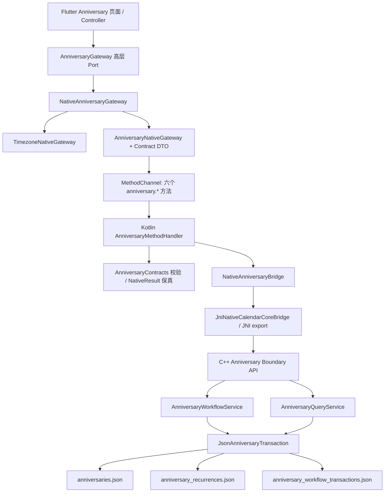

# 纪念日功能全链路审查结果

- 审查日期：2026-08-10（Asia/Shanghai）
- 审查 Skill：`review-worktree-architecture`
- 仓库：`A:\calendar\ExcellentCalendarAPP`
- 分支 / HEAD：`HXY-study` / `07ba8b6e2bbcc1861388fbf46da37817661e89fd`
- 审查基线：开始时共 150 个未提交路径，staged 0、unstaged 60、untracked 90；初始 scope hash 为 `691f68f96ec9d5b1c06da6d8a50efc5f1ec94c261fbf0f08289d975b155b718a`
- 审查性质：只审查，不修改生产代码；本文件与 `docs/log.md` 是本次唯一预期写入
- 最终建议：**修复P0/P1后可以提交**

## 1. Executive Summary

Anniversary V1 的底层六方法闭环已经真实存在，不是 Fake 或固定 JSON：Contract、Dart MethodChannel DTO、Kotlin Handler、JNI、C++ Domain/Application/Boundary、JSON Storage 均已接通。C++ 全量检查 5/5、Flutter 全量测试 179/179、`flutter analyze`、Android JVM 测试、Debug/AndroidTest 构建和 Debug APK 构建均通过；真实 realme RMX5100 设备上，Kotlin→JNI→C++→JSON Storage smoke 通过，临时独立 Flutter 全链测试也完成了 create/detail/list/update/preview/delete 六方法。

核心领域规则总体正确：Anniversary 是独立实体；年度规则是 Anniversary 专属的 `yearly + interval=1`；一次性/年度切换使用专用两 Store journal；倒计时按 IANA timezone 的本地自然日计算；2 月 29 日在非闰年落到 2 月最后一天；删除是软删除；Reminder、农历成功计算、preset、AI 和云能力没有被伪装成已完成。

当前不能直接提交，主要原因不是 C++ 核心不可用，而是生产 Flutter 组合仍保留 Fake 原型的能力表面：除“全部”外的列表筛选都会失败；倒数日/生日/节日类型和 Reminder 开关可以选择但提交必失败；Native 已实现的 preview 在生产高层 Gateway 中无条件抛错；列表只取默认第一页 20 条且没有后续页入口。另有 150 路径混合工作区，包含分类、新建日程、通知启动拆分、Kotlin/C++ 职责重构和 v1 清理策略等多个独立主题，不能视作一份可安全回滚的 Anniversary 提交。

### 审查过程中的重要数据事件

本次临时 Flutter 真机 integration test 使用了正式 Debug application id。Flutter 测试工具在结束时卸载了目标 Debug 包，导致该包的私有数据被清空；至少确认丢失了测试前存在的活动纪念日“我们”（2026-08-24），历史 tombstone 及其他私有 Store 也可能一并受影响。发现后已立即停止继续使用该方式，重新安装当前 Debug APK、移除临时测试包并确认主包可启动；重新初始化后的 `anniversaries.json` 为空。没有可用的完整安全备份，因此未擅自重建未知数据。该事件不属于被审生产代码的功能结论，但证明全链测试必须使用独立 application id / 测试 flavor / 隔离数据目录。

## 2. Current Anniversary Architecture Map



### 六个公开能力

| MethodChannel | Kotlin→JNI→C++ | 当前结果 |
|---|---|---|
| `anniversary.create` | `nativeCreateAnniversaryV2` → `create_anniversary_v2` | 通过 |
| `anniversary.update` | `nativeUpdateAnniversaryV2` → `update_anniversary_v2` | 通过 |
| `anniversary.delete` | `nativeDeleteAnniversaryV2` → `delete_anniversary_v2` | 通过 |
| `anniversary.detail` | `nativeGetAnniversaryDetailV2` → `get_anniversary_detail_v2` | 通过 |
| `anniversary.list` | `nativeListAnniversariesV2` → `list_anniversaries_v2` | 底层通过；生产 UI 分页/筛选不完整 |
| `anniversary.preview_countdown` | `nativePreviewAnniversaryCountdownV2` → `preview_anniversary_countdown_v2` | 底层通过；生产高层 Port 不可达 |

### 职责结论

- Flutter Presentation/Controller 负责表单、筛选和异步状态；不直接访问 MethodChannel。
- Dart DTO/MethodChannel adapter 严格使用 `snake_case`，并验证 `NativeResult v2`。
- Kotlin Handler 是窄路由与边界校验层，没有重写倒计时、重复规则或持久化业务。
- C++ Application/Domain 持有标题、日期、历法、年度规则切换、软删除与倒计时规则。
- Anniversary 使用三个独立 JSON Store，不进入 Event/Reminder 六 Store journal。
- Reminder 当前为明确的 `not_applicable`，不能通过独立 `reminder.create` 绕过尚未冻结的 occurrence/幂等设计门禁。

## 3. Test Matrix

以下矩阵在详细阅读未提交实现前由独立测试 oracle 冻结；“部分通过”表示已验证一部分行为，但还存在明确缺口，不能按完整覆盖宣称通过。

| ID | 独立 Oracle | 结果 | 证据 / 缺口 |
|---|---|---|---|
| O01 | 六方法、请求、响应、NativeResult 一致 | 通过 | Contract、Dart 常量、Kotlin 路由、JNI declaration/export、C++ endpoint 6/6 对齐；真机可调用 |
| O02 | 严格 request shape、显式 null、snake_case | 部分通过 | Dart/Kotlin/C++ 拒绝漏字段、未知字段、错误类型；大 Unicode/emoji 未通过真实 JNI 独立验证 |
| O03 | NativeResult v2 状态机 | 通过 | Dart DTO、Kotlin validator、C++ Boundary 测试覆盖成功/失败 envelope 与版本校验 |
| O04 | NativeError code/message/details/retryable 保真 | **失败（Flutter Application）** | Kotlin/MethodChannel 保真；`NativeAnniversaryGateway` 丢弃 details，并把多类稳定错误降为 `unknown` |
| O05 | 一次性 create 真落盘 | 通过 | `recurrence=null`、重启 detail、真实 Storage 与真机链路均通过 |
| O06 | 年度 create 原子建立专属规则 | 通过 | 非空 recurrence_id、规则 ID 一致、Store 原子提交通过 |
| O07 | update 为完整 replacement | 通过 | yearly→yearly 保留 recurrence_id；缺字段被边界拒绝 |
| O08 | recurrence 状态切换事务 | 部分通过 | yearly↔one-time 生命周期与一次中断重放通过；所有 crash phase 和并发竞态未覆盖 |
| O09 | detail 仅 active 且引用完整 | 通过 | active 查询、删除后 NOT_FOUND、坏引用显式失败路径已验证 |
| O10 | delete 为软删除 | 通过 | 返回非空 deleted_at；list/detail 不再可见；重复删除失败 |
| O11 | 一次性倒计时 | 通过 | remaining/today/elapsed、本地日期、weekday 一致性通过 |
| O12 | 年度倒计时动态计算 | 通过 | 同年、跨年、today 及不预生成 occurrence 通过 |
| O13 | 2 月 29 日规则 | 通过 | 非闰年 02-28、闰年 02-29 规则通过 |
| O14 | IANA timezone 与本地自然日 | 部分通过 | Asia/Shanghai、非法 timezone 通过；极端时区对照和 DST 春季跨越未执行 |
| O15 | lunar 稳定拒绝 | **底层通过 / UI 失败** | C++ 返回 `ANNIVERSARY_CALENDAR_UNSUPPORTED`；UI 未按 target 明确提示，最终显示通用失败 |
| O16 | list category/importance 过滤 | 部分通过 | 单值组合过滤和 DTO 数组校验通过；多值、无匹配、重复值的完整端到端矩阵未全部执行 |
| O17 | list 排序、分页、cursor | **部分通过 / UI 失败** | C++ sort/cursor 拒绝路径通过；稳定 tie、多页黑盒未完全覆盖；UI 只显示默认前 20 条 |
| O18 | 派生字段不持久化 | 部分通过 | Store 中未保存 countdown/timezone/future occurrence；跨本地日重启变化未执行 |
| O19 | 真实 Storage 重启、增量初始化 | 通过（有观察项） | 重启与合法旧 v2 增量初始化通过；共享 recurring runtime 会规范化 `workflow_transactions.json` 的字节形式，语义未变 |
| O20 | journal 原子性/恢复 | 部分通过 | prepared 后首 Store 中断与恢复通过；其他 crash phase、损坏 journal 未完整覆盖 |
| O21 | Flutter adapter/controller 状态 | **失败（生产组合）** | Fake/controller 单测通过；生产 Native Gateway 与可见 filter/kind/reminder/preview 不兼容 |
| O22 | 重复点击边界 | 部分通过 | Fake controller 防重复 submit 通过；真实生产 Widget double-tap 未执行；Native 无 idempotency key，不强行要求请求重放去重 |
| O23 | Kotlin handler/contract | 通过 | 六路由、非法输入、business error 与 malformed success 测试通过 |
| O24 | JNI ABI/异常边界 | 通过（Unicode 未覆盖） | 6/6 declaration/export、真机 `.so` 调用与 NativeResult 通过；emoji/modified UTF-8 风险未独立验证 |
| O25 | Flutter→MethodChannel→Kotlin→JNI→C++→Storage | 部分通过 | 临时真机测试覆盖六方法和真实 Store；未形成可保留回归测试，且测试 teardown 造成 Debug 私有数据丢失 |
| O26 | 共享 Storage 回归 | 通过（字节观察项） | Anniversary CRUD 未改变其他业务语义数据；共享 runtime 对空 journal 做了字节规范化 |

### Not Applicable

- Anniversary Reminder 创建、更新、Alarm、Notification 和投递：N/A。
- 农历成功计算与农历 occurrence：N/A；只要求 typed rejection。
- restore、hard delete、preset 隐藏/复制：N/A。
- Event Recurrence revision、RRULE、interval>1：N/A。
- keyword、kind/count_mode Native 过滤、独立 upcoming API：N/A。
- SQLite、AI 祝福、云同步/备份：N/A；当前实现真相源是 JSON Storage v2。

## 4. Commands Executed

### Git 与范围

- `git status --short --untracked-files=all`
- `git diff --name-status HEAD`
- `git diff --stat HEAD`
- `git diff --check HEAD`：通过，仅出现工作区 LF→CRLF 提示；无 whitespace error。
- staged diff：为空。

### Contract

- 129 个 JSON Schema 的 JSON 语法、`$id` 唯一性及 72 个本地 `$ref` 闭合扫描：`129 / 129`，0 error。
- 六方法在 `method_channels.yaml`、`native_calls.yaml`、Dart 常量、Kotlin Handler、JNI 和 C++ endpoint 的静态对照：6/6。
- 当前环境没有 PyYAML、Ruby 或 `jsonschema` 包；没有联网安装依赖。因此本轮未独立执行完整 YAML parser 和 Draft 2020-12 instance validator。Kotlin/C++/Dart 边界测试已实际解析同一业务 payload，但不能替代 Schema 引擎验证。

### C++

```text
A:\Android\sdk\cmake\3.22.1\bin\cmake.exe -S cpp_core -B cpp_core/build-ninja -G Ninja -DCMAKE_MAKE_PROGRAM=A:\Android\sdk\cmake\3.22.1\bin\ninja.exe -DEXCELLENT_CALENDAR_BUILD_TESTS=ON
cmake --build cpp_core/build-ninja --target excellent_calendar_check
```

结果：CTest 5/5 通过（core、reminder、recurrence、boundary_v2、anniversary）。

另创建并运行了临时、独立命名的 C++ public-boundary 黑盒 harness，覆盖 pre-init、增量 v2、空白标题、非法日期、lunar、未知字段、非法 timezone、cursor、today、2/29、recurrence 生命周期、Store 隔离、runtime 重启和软删除；全部通过。临时源文件和 `.review_tmp` 产物已删除，没有并入工作区。

### Flutter / Dart

```text
flutter test test/method_channel_anniversary_adapter_test.dart
flutter test test/native_anniversary_gateway_test.dart
flutter analyze
flutter test
flutter build apk --debug
```

结果：定向测试分别 3/3、4/4；`flutter analyze` 0 issue；全量 Flutter 179/179；Debug APK 构建通过。

### Android / Kotlin / JNI

```text
gradlew.bat :app:testDebugUnitTest --tests *AnniversaryMethodChannelHandlerTest --tests *JniNativeCalendarCoreBridgeAnniversaryTest
gradlew.bat :app:testDebugUnitTest
gradlew.bat :app:assembleDebug :app:assembleDebugAndroidTest
gradlew.bat :app:lintDebug
```

结果：Anniversary 定向测试、全量 JVM 测试、Debug 与 AndroidTest APK 构建通过。`lintDebug` 未通过：全项目 29 error / 20 warning，首项为 `AlarmManagerReminderScheduler.kt:39` 在 minSdk 24 使用 API 26 `Instant.parse`；生成报告中没有 Anniversary/Smoke 新 finding，因此标记为既有基线阻断，不能宣称全库 lint 通过。

### 真实设备

- 设备：realme RMX5100，serial `3L1F96E8NZVEBNH2`，Android 16 / API 36。
- Debug-only Receiver 正式 factory 路径：Kotlin→JNI→C++→JSON Storage，create→detail 持久化→soft-delete：PASS，记录 ID `e1ffed...`。
- 临时 Flutter integration test：DTO/MethodChannel→Kotlin Handler→JNI→C++→真实 JSON Store；create、detail、list、yearly→one-time update、today preview、delete、删除后 typed error 全部通过。
- 该临时测试没有保留在仓库；teardown 卸载 Debug 包并清空私有数据，详见 Executive Summary 的数据事件。

## 5. Findings

### [P1] F1：生产 UI 暴露的筛选、类型、Reminder 与 preview 与 Native V1 能力不兼容  *

证据：

- `flutter_client/lib/main.dart:67` 把生产页面接到 `NativeAnniversaryGateway`。
- `native_anniversary_gateway.dart:27-34` 对任何非空 `query.kind` 直接抛错。
- `anniversary_list_controller.dart:8-18,50-52` 给除“全部”外的每个筛选都发送非空 kind。
- `native_anniversary_gateway.dart:57-58,80-81,135-152` 拒绝非 `anniversary` 类型及任何 Reminder plan。
- `anniversary_form_fields.dart:122-145,199-223` 仍展示 Reminder 开关、倒数日、生日和节日类型。
- `native_anniversary_gateway.dart:111-117` 的 `previewCountdown` 无条件抛错；`anniversary_form_controller.dart:253-283` 每次选日期仍调用它。
- `anniversary_form_fields.dart:246-252` 允许选择农历；当前高层错误映射最终只展示通用失败，不满足 `docs/target.md:37` 的明确“不支持农历”提示。

触发条件：用户点击任一非“全部”筛选，或选择倒数日/生日/节日，或开启提醒，或在生产表单中查看倒计时预览。

影响：列表进入错误态；表单看似支持的选项无法保存；Native 已完成的 preview 在正式页面永远不可用。这不是尚未实现按钮被禁用，而是可交互入口在提交后失败。

建议：V1 提交前二选一：一是只展示 `anniversary + solar + no reminder`，对农历给明确不可用文案，并移除无真实数据语义的筛选；二是先补齐 Flutter 高层 Port、持久化/Contract 语义再开放入口。不能把 Fake 原型行为当作生产验收。

### [P1] F2：生产列表永久丢失第 21 条及之后的活动纪念日 *

证据：

- `AnniversaryGateway.list` 只返回 `List<AnniversaryListItem>`，`AnniversaryListQuery` 只有 kind，没有 page/page_size 或 pagination metadata（`anniversary_gateway.dart:3-14`、`anniversary_models.dart:121-125`）。
- `NativeAnniversaryGateway.list` 只发送 timezone，并丢弃 response.pagination（`native_anniversary_gateway.dart:27-41`）。
- 公共 pagination 默认 `page_size=20`（`pagination_request.schema.json:18-25`）。
- 列表页面只渲染 controller 当前 items，没有 load-more 或下一页入口（`anniversary_list_page.dart:170-184`）。

触发条件：活动 Anniversary 数量超过 20。

影响：第 21 条开始在正式 UI 永远不可见，用户会把持久化成功的数据误认为丢失。

建议：让 Application Port 返回带 `items/pagination` 的页面对象，并实现稳定的加载更多/分页；增加 21+ 条生产组合测试。临时固定请求 200 只能作为有明确上限的过渡，不能当作完整分页实现。

### [P1] F3：150 路径工作区混合了多个独立业务与架构变更，不能作为单一 Anniversary 提交安全回滚 

证据：staged 为 0；当前同时存在 Anniversary 全链、Category Fake/页面、新建日程与重复日程编辑、通知 permission/lifecycle 拆分、Kotlin Handler/Contract 职责拆分、C++ recurring endpoint/validator 拆分、v1 Storage 清理策略、根 `AGENTS.md`、`docs/temp.md` 大幅变化及两个删除文件。

影响：`git add .` 会把多项独立用户决策和重构绑在同一提交；review、bisect、回滚与 cherry-pick 都无法隔离。尤其 v1 由“归档”改成“确认后直接 `remove_all`”虽已在当前 docs 标记为用户决策，但它是不可逆升级策略，不应因 Anniversary 提交被顺带带入。

建议：先按已完成任务恢复清晰的提交边界；至少拆分为既有职责重构、v2 Storage 决策、Category/日程、Anniversary Contract/Core、Android bridge、Flutter production integration、文档记录。逐组 stage 并重跑各自门禁，不要一次性提交 150 路径。

### [P1] F4：全链 Flutter 测试没有隔离 application id / 私有数据，已经造成一次真实 Debug 数据清空

证据：本次临时真机 integration test 对正式 Debug application id 运行，测试工具 teardown 卸载应用；至少一个活动 Anniversary 和现有私有 Store 被清除。当前仓库保留的 Debug Receiver 也使用正式 v2 storage 目录，虽然 runner 会软删除 fixture，仍会留下 tombstone。

影响：开发者执行真实全链验收可能破坏手工调试数据，并让测试结果与日常数据相互污染。

建议：在下一次 Flutter/Android 全链测试前增加专用 review/integration flavor、`applicationIdSuffix` 和独立 Storage 根；fixture 用硬隔离目录，测试结束只清理该目录。禁止再对承载手工数据的 Debug 包运行会卸载应用的命令。

### [P2] F5：Anniversary list 的 top-level 与 nested 排序 Contract 存在可验证的歧义 *

证据：`list_anniversaries_request.schema.json:42-59` 在 top-level 只允许两个 sort key，并声明缺失默认 asc；其 `pagination` 引用的公共 Schema 在 `pagination_request.schema.json:33-49` 又允许任意字符串 `sort_by` 且默认 direction 为 desc。C++ 在 `anniversary_v2_endpoint.cpp:194-232` 同时读取两处、top-level 优先，并最终只接受两个 key。Dart `PaginationRequestDto` 同样允许任意 `sortBy` 且默认 desc。

影响：一个可以通过 JSON Schema 的 nested `pagination.sort_by="title"` 会被 C++ 作为 Contract failure 拒绝；调用方仅使用公共 Pagination DTO 时还可能得到与 Anniversary 文档相反的默认排序。

建议：冻结唯一排序位置。优先为 Anniversary 定义不含 nested sort 的分页 fragment，或在 Schema 中对 nested key 加同一 enum 和明确优先级；补 schema validator corpus 和双位置冲突测试。

### [P2] F6：detail/list 等只读查询每次都会重写 Anniversary journal

证据：`JsonAnniversaryTransaction::load()` 在 `json_anniversary_transaction.cpp:245-255` 每次调用 `recover_locked()`；`recover_locked()` 在 journal 已为空时仍执行 `write_json_file(empty_journal())`（`:328-343`）。

影响：只读查询产生文件替换、mtime/flash 写入和额外失败点；Storage 可读但暂时不可写时，detail/list 会因无必要的 journal 清空而失败。

建议：仅在 journal 实际包含 prepared/committed transaction 且完成恢复后清空；增加“空 journal 查询不改字节/mtime”和“数据可读、journal 不可写仍可查询”的黑盒测试。

### [P2] F7：生产日期选择器使用硬编码的 2026-08-06 Clock *

证据：`flutter_client/lib/main.dart:62` 在生产 composition 中创建 `FixedAppClock(DateTime(2026, 8, 6))`；`create_anniversary_page.dart:54-60` 用它作为日期选择器的 currentDate。仓库中没有 SystemAppClock 实现。

影响：从 2026-08-07 起，新建纪念日日期选择器默认日期永久过期；本次审查日期 2026-08-10 已能复现逻辑偏差。

建议：生产注入系统 Clock，测试继续注入 Fixed Clock；增加 composition test 以防 Fake/Fixed 依赖进入生产 main。

### [P2] F8：Dart Application adapter 缩窄了 Contract 合法响应，并丢失稳定错误语义

证据：`anniversary_response.schema.json:69-80` 允许 `importance=null`，Dart DTO 也正确解析 nullable；但 `native_anniversary_gateway.dart:176-185` 对 null 直接抛 Contract failure。`native_anniversary_gateway.dart:269-278` 只映射少数错误，未覆盖 `ANNIVERSARY_CALENDAR_UNSUPPORTED`、`TIMEZONE_ID_INVALID`、`STORAGE_*`、`FEATURE_NOT_IMPLEMENTED`，高层 Exception 也没有 details 字段。

影响：合法旧数据/seed 数据可能让整个 list/detail 无法投影；用户只能看到通用“操作失败”，上层无法根据 retryable/details 做正确恢复。

建议：要么在 active Anniversary response Contract 中把 importance 冻结为非空并同步 Storage migration，要么让 Flutter 有明确的 null projection；扩展高层错误模型并保留 code/message/details/retryable。

### [P2] F9：项目真相文档互相矛盾，且删除后以拼写错误文件名恢复了过期文档

证据：

- `docs/develop_record.md:17` 与 `docs/target.md:40` 声明六方法已 integrated。
- `docs/problems.md:11-17,35` 仍声明 Anniversary C++/Storage 尚未落地、Contract 仍 planned。
- tracked 的 `docs/anniversary_frontend_contract_requirements.md` 被删除，untracked 的 `docs/anniversary_equirements.md` 与其内容逐字相同，仅文件名拼错；该文档 `:7-8` 仍称 MethodChannel 只有 create、native_calls 没有 Anniversary。

影响：未来 Agent 按强制阅读顺序会先得到相互冲突的当前状态，可能重复开发或把 integrated 能力降级为 planned。

建议：关闭/划除已解决的 `docs/problems.md` 条目；将原型需求文档明确标记为历史记录或更新为当前六方法，恢复正确文件名，避免两个相反“真相源”。

## 6. Architecture Compliance Matrix

| 规则 | 状态 | 结论 |
|---|---|---|
| Anniversary 独立于 Event | 通过 | 独立 Domain、Application、Boundary、Store 与 journal |
| Contract 先行、snake_case、NativeResult | 通过（list sort 歧义除外） | 六方法对齐；F5 需修复 |
| Flutter UI 不直接访问 MethodChannel | 通过 | 经 Controller/Port/Adapter |
| Flutter 可见能力必须有真实实现 | **不通过** | F1：Fake 原型入口与 Native V1 不匹配 |
| Application Port 能表达完整用例 | **不通过** | preview recurrence 与 list pagination 无法表达 |
| Kotlin 只做 Android/边界适配 | 通过 | Anniversary Handler 窄，核心规则未上移 |
| JNI ABI 与异常边界 | 通过 | 6/6 declaration/export，真机成功 |
| C++ Core 持有业务不变量 | 通过 | 日期、历法、重复、软删除、倒计时均在 Core |
| Repository/Storage 统一持久化 | 通过（有副作用） | 无散落 SQL；F6 只读查询写 journal |
| Reminder/Notification 职责不混用 | 通过 | 当前 Anniversary Reminder 明确未接入 |
| 派生 countdown 不持久化 | 通过 | 查询投影，不回写事实 |
| 测试独立且不污染真实数据 | **不通过** | F4 已发生数据清空 |
| 未提交变更可独立审查/回滚 | **不通过** | F3：150 路径多主题混合 |
| 当前状态文档一致 | **不通过** | F9 |

## 7. Uncommitted Change Review

### 7.1 范围摘要

- 审查开始时 staged：0。
- 审查开始时 tracked unstaged：60（其中删除 2）。
- 审查开始时 untracked：90。
- Anniversary 相关文件没有任何一组已被独立 stage，因此“当前可提交集合”尚未定义。

最终范围复核为 151 个路径、staged 0、unstaged 60、untracked 91，scope hash 为 `786e069eab63962520eb4c83246587d68f80f744a6b6389f7dc546e340a96569`。相对初始范围只增加了用户要求的 `纪念日功能审查结果.md`；`docs/log.md` 在开始时已经是 untracked，本次只按项目规则追加日志。没有临时测试源、integration test 或 `.review_tmp` 二进制残留。

### 7.2 Anniversary 相关文件逐项结论

#### Contract 与文档

| 状态 | 文件 | 结论 |
|---|---|---|
| M | `README.md` | Anniversary integrated 架构记录正确；与其他主题混改，需按提交拆分 |
| M | `contracts/README.md` | 六方法、Store 与 V1 边界说明总体一致 |
| M | `contracts/anniversary/anniversary_list_response.schema.json` | 分页响应引用正确 |
| M | `contracts/anniversary/anniversary_response.schema.json` | 事实/派生分离正确；nullable importance 与 Flutter 投影不一致（F8） |
| M | `contracts/anniversary/create_anniversary_request.schema.json` | 完整 create plan、显式 null、timezone、lunar typed rejection 正确 |
| ?? | `contracts/anniversary/anniversary_countdown_response.schema.json` | 自然日投影字段完整 |
| ?? | `contracts/anniversary/anniversary_detail_response.schema.json` | active solar 与 recurrence 一致性描述正确 |
| ?? | `contracts/anniversary/anniversary_recurrence_response.schema.json` | 专属 yearly+1 响应正确 |
| ?? | `contracts/anniversary/anniversary_recurrence_rule_input.schema.json` | 不复用 Event recurrence，正确 |
| ?? | `contracts/anniversary/anniversary_summary_response.schema.json` | 事实与 Flutter label/icon 分离正确 |
| ?? | `contracts/anniversary/delete_anniversary_request.schema.json` | 仅 ID、软删除用例正确 |
| ?? | `contracts/anniversary/deleted_anniversary_response.schema.json` | 强制非空 deleted_at，正确 |
| ?? | `contracts/anniversary/get_anniversary_detail_request.schema.json` | ID + timezone 正确 |
| ?? | `contracts/anniversary/list_anniversaries_request.schema.json` | filter/sort/cursor 意图正确；nested sort 歧义见 F5 |
| ?? | `contracts/anniversary/preview_anniversary_countdown_request.schema.json` | 无落盘字段，正确 |
| ?? | `contracts/anniversary/update_anniversary_request.schema.json` | 完整 replacement，正确 |
| M | `contracts/common/native_error.schema.json` | 新错误码同步正确 |
| M | `contracts/enums.yaml` | countdown relation/sort enum 正确 |
| M | `contracts/error_codes.yaml` | typed lunar error 正确 |
| M | `contracts/method_channels.yaml` | 六方法 integrated，与 Dart/Kotlin 对齐 |
| M | `contracts/native_calls.yaml` | 六个 Native call integrated，与 JNI/C++ 对齐 |
| M | `contracts/recurrence/recurrence_rule.schema.json` | 将通用 planned 规则收窄为 Habit，避免误用于 Anniversary，正确 |
| M | `contracts/storage/calendar_core_storage.yaml` | 三 Store 与独立 journal 正确；同文件还含不可逆 v1 清理策略，建议独立提交 |
| M | `docs/DATA_MODEL.md` | Anniversary/Recurrence 不变量与动态 occurrence 说明正确 |
| M | `docs/develop_record.md` | 当前 integrated 记录正确，也明确暴露 Flutter port 缺口 |
| M | `docs/problems.md` | 存在未关闭的 planned 旧结论，需修复 F9 |
| M | `docs/target.md` | 当前 V1 边界总体正确；UI 农历提示未落实 |
| D | `docs/anniversary_frontend_contract_requirements.md` | 删除后出现拼错同内容副本，不应按当前状态提交 |
| ?? | `docs/anniversary_equirements.md` | 与被删文件逐字相同且已过期，需按 F9 处理 |
| ?? | `docs/anniversary_android_native_bridge_record.md` | 真机/JNI 记录有证据支持；应补充完整 Flutter E2E 隔离要求 |
| ?? | `docs/task/纪念日开发/纪念日CPP层开发要求.md` | 作为任务来源可保留，当前实现总体满足 |

#### C++ Core / Storage

| 状态 | 文件 | 结论 |
|---|---|---|
| M | `cpp_core/CMakeLists.txt` | 新源与 Anniversary test 纳入构建，check 通过 |
| M | `cpp_core/include/excellent_calendar/boundary/api/native_runtime.hpp` | runtime 暴露 Anniversary service 依赖，职责可接受 |
| M | `cpp_core/src/boundary/api/native_runtime.cpp` | 正式 runtime composition 完整 |
| M | `cpp_core/src/common/error_code_metadata.cpp` | typed Anniversary 错误元数据同步正确 |
| M | `cpp_core/include/excellent_calendar/storage/json/calendar_core_v2_storage_bootstrap.hpp` | 三 Store 与 v1 discard 同文件混改；后者需独立审查/提交 |
| M | `cpp_core/src/storage/json/calendar_core_v2_storage_bootstrap.cpp` | Anniversary additive whitelist 正确；不可逆 v1 `remove_all` 属独立决策 |
| ?? | `cpp_core/include/excellent_calendar/application/anniversary_query_service.hpp` | 查询职责窄，接口合理 |
| ?? | `cpp_core/include/excellent_calendar/application/anniversary_types.hpp` | Command/Query/Projection 与 Domain 分离 |
| ?? | `cpp_core/include/excellent_calendar/application/anniversary_workflow_service.hpp` | create/update/delete workflow 边界合理 |
| ?? | `cpp_core/include/excellent_calendar/boundary/api/anniversary_api.hpp` | 六个窄 API 与 Native call 对齐 |
| ?? | `cpp_core/include/excellent_calendar/boundary/contract/anniversary_json.hpp` | JSON 仅存在于 boundary |
| ?? | `cpp_core/include/excellent_calendar/domain/anniversary.hpp` | 独立 Anniversary/Recurrence 与倒计时规则合理 |
| ?? | `cpp_core/include/excellent_calendar/repository/anniversary_transaction.hpp` | Repository 抽象没有泄漏 JSON |
| ?? | `cpp_core/include/excellent_calendar/storage/json/anniversary_json_codec.hpp` | codec 与 transaction 分离 |
| ?? | `cpp_core/include/excellent_calendar/storage/json/json_anniversary_transaction.hpp` | 独立两 Store transaction 合理；load 写 journal 见 F6 |
| ?? | `cpp_core/src/application/anniversary_query_service.cpp` | 动态投影、active 查询职责正确 |
| ?? | `cpp_core/src/application/anniversary_workflow_service.cpp` | 生命周期与防御校验正确 |
| ?? | `cpp_core/src/boundary/api/anniversary_v2_endpoint.cpp` | 严格字段校验正确；nested sort 语义需与 Schema 统一 |
| ?? | `cpp_core/src/boundary/contract/anniversary_json.cpp` | NativeResult data 结构正确 |
| ?? | `cpp_core/src/domain/anniversary.cpp` | 日期/时区/闰年规则通过独立黑盒 |
| ?? | `cpp_core/src/storage/json/anniversary_json_codec.cpp` | Store root 和实体校验严格，不静默重置 |
| ?? | `cpp_core/src/storage/json/json_anniversary_transaction.cpp` | 原子写与恢复总体正确；F6 需修复 |
| ?? | `cpp_core/tests/anniversary_core_tests.cpp` | 覆盖核心 happy/negative/restart/recovery；仍缺完整 crash/sort/TZ 矩阵 |

#### Kotlin / JNI / Android test harness

| 状态 | 文件 | 结论 |
|---|---|---|
| M | `flutter_client/android/app/src/debug/AndroidManifest.xml` | Receiver 仅 debug 且受 DUMP 权限保护；不进入 release |
| M | `flutter_client/android/app/src/main/cpp/boundary/adapter/jni/event_jni.cpp` | 六 export 正确；文件名仍是 Event 且承载多域，建议后续重命名/拆分；Unicode 风险待测 |
| M | `.../bridge/channel/NativeMethodChannelHandler.kt` | 作为 registry/composition façade 可接受；依赖新拆分文件，必须同组提交 |
| M | `.../bridge/contract/NativeErrorContract.kt` | 新错误码对齐 |
| M | `.../bridge/contract/V2BoundaryContracts.kt` | Anniversary 未继续塞入 God validator，方向正确；属于共享职责重构 |
| M | `.../bridge/native/CalendarCoreStorageDirectoryResolver.kt` | v1 来源/目录策略为独立高风险主题，不应混入 Anniversary commit |
| M | `.../bridge/native/CalendarCoreV2RuntimeDirectories.kt` | Anniversary runtime 目录组合通过 |
| M | `.../bridge/native/JniNativeCalendarCoreBridge.kt` | 六 external 与 C++ export 对齐 |
| M | `.../bridge/native/NativeCalendarCoreBridge.kt` | 聚合 bridge 继承窄 Anniversary bridge，符合 README 规则 |
| M | `.../bridge/NativeMethodChannelHandlerTest.kt` | 共享 registry 回归通过 |
| M | `.../bridge/native/CalendarCoreStorageDirectoryResolverTest.kt` | 属 v1 策略，不应靠 Anniversary 提交携带 |
| M | `.../bridge/native/CalendarCoreV2StorageDirectoryResolverTest.kt` | v2 目录行为通过 |
| ?? | `flutter_client/android/app/src/main/kotlin/com/excellentcalendar/excellent_calendar/bridge/channel/AnniversaryMethodHandler.kt` | 六窄路由、exactly-once completion 正确 |
| ?? | `.../bridge/contract/AnniversaryContracts.kt` | request/response 双向校验严格，minSdk 安全 |
| ?? | `.../bridge/native/NativeAnniversaryBridge.kt` | 窄接口符合模块边界 |
| ?? | `.../bridge/AnniversaryMethodChannelHandlerTest.kt` | 六路由/错误/非法响应覆盖良好 |
| ?? | `.../bridge/native/JniNativeCalendarCoreBridgeAnniversaryTest.kt` | JNI wrapper 定向回归通过 |
| ?? | `flutter_client/android/app/src/androidTest/AndroidManifest.xml` | instrumentation 配置可构建；需独立 package/data |
| ?? | `.../androidTest/.../AnniversaryJniSmokeInstrumentation.kt` | 真 JNI 验证有价值；当前正式目录污染风险见 F4 |
| ?? | `.../debug/.../AnniversaryJniSmokeReceiver.kt` | debug-only 入口受保护，合理 |
| ?? | `.../debug/.../AnniversaryJniSmokeRunner.kt` | 正式 factory 路径真实；fixture 软删会留 tombstone，需隔离 |

#### Flutter Native integration

| 状态 | 文件 | 结论 |
|---|---|---|
| M | `flutter_client/lib/main.dart` | Native Gateway 正式接入；硬编码 Clock 与 Fake capability 表面见 F1/F7 |
| M | `flutter_client/lib/boundary_adapters/dart_method_channel/native_method_channel_contract.dart` | 六方法常量与 YAML 一致 |
| M | `flutter_client/lib/native_contract/common/native_error_codes.dart` | typed lunar code 已加入；高层未完整映射 |
| ?? | `flutter_client/lib/boundary_adapters/dart_method_channel/method_channel_anniversary_adapter.dart` | 六方法与 DTO mapper 对齐，定向测试通过 |
| ?? | `flutter_client/lib/data/anniversary/native_anniversary_gateway.dart` | 底层调用真实；生产 Port 能力不匹配是 F1/F2/F8 根因 |
| ?? | `flutter_client/lib/gateway_interfaces/anniversary_native_gateway.dart` | typed 窄 Native port 合理 |
| ?? | `flutter_client/lib/native_contract/anniversary/anniversary_contract_enums.dart` | 稳定字符串枚举正确 |
| ?? | `flutter_client/lib/native_contract/anniversary/anniversary_mapper.dart` | NativeResult/data 映射严格 |
| ?? | `flutter_client/lib/native_contract/anniversary/anniversary_request_dtos.dart` | 显式 null、日期与 snake_case 正确；Pagination DTO 语义需按 F5 收敛 |
| ?? | `flutter_client/lib/native_contract/anniversary/anniversary_response_dtos.dart` | response exact keys 与一致性检查良好；nullable importance 后续被错误收窄 |
| ?? | `flutter_client/test/method_channel_anniversary_adapter_test.dart` | DTO/MethodChannel 契约覆盖通过 |
| ?? | `flutter_client/test/native_anniversary_gateway_test.dart` | 明确记录 unsupported 行为；缺少与真实 Widget 的 production composition 测试 |

### 7.3 明确属于混合范围、应另行提交/审查的路径组

- Flutter Category 与 New Schedule：`application/category/**`、`presentation/category/**`、`data/category/**`、`gateway_interfaces/category_repository.dart`、`presentation/new_schedule/**` 及其测试。
- Flutter 通知/日程职责拆分：`app_notification_bootstrap.dart`、`notification_permission_controller.dart`、`reminder_schedule_lifecycle_coordinator.dart`、`application/event/**`、`presentation/event_detail/**` 及相关测试。
- Kotlin 通用职责拆分：`ChannelMethodHandler.kt`、`EventMethodHandler.kt`、`ReminderMethodHandler.kt`、`NotificationMethodHandler.kt`、`RuntimeMethodHandler.kt`、`NativeCallExecutor.kt`、`MutationScheduleHook.kt` 及 Event/Occurrence/Recurrence/Reminder Contract 文件。
- C++ 通用职责拆分：tracked `recurring_v2_api.cpp`/`recurring_event_json_codec.cpp` 的大幅删除及 untracked `event_v2_endpoint.cpp`、`reminder_v2_endpoint.cpp`、`runtime_v2_endpoint.cpp`、`recurring_v2_api_internal.hpp`、`recurring_v2_api_support.cpp`、`recurring_event_state_validator.cpp`、`boundary_v2_characterization_tests.cpp`。
- 升级策略：`identity.yaml` active、v1 目录不归档直接清理、Kotlin storage resolver 迁移源变化。
- 项目规则/临时文档：`AGENTS.md`、`docs/temp.md`、其他 review/task 文档。

## 8. Redundancy and Complexity Review

### 合理复杂度

- Anniversary 使用独立 transaction/journal，而不是硬塞进 Event/Reminder 六 Store：这是领域不变量和故障恢复要求带来的必要复杂度。
- Kotlin 使用 `AnniversaryMethodHandler`、`AnniversaryContracts`、`NativeAnniversaryBridge`：避免中心 Handler/God Contract 继续膨胀，职责合理。
- Dart 区分高层 `AnniversaryGateway` 与低层 `AnniversaryNativeGateway`：方向正确，问题在两者能力模型未完成收敛。

### 可删除或收敛的冗余

- 生产 UI 中的 kind/filter/reminder/lunar 表面来自 Fake 原型，但 Native V1 没有对应事实语义；在协议完成前应隐藏/禁用，而不是维持两套相反能力。
- `docs/anniversary_equirements.md` 是被删除文档的拼写错误同内容副本，且内容已过期。
- `event_jni.cpp` 已承载 Event、Anniversary、Reminder 等多域 JNI export，文件名造成认知误导；可在独立无行为重构中改为通用 `calendar_core_jni.cpp` 或按域拆分。
- `JsonAnniversaryTransaction::recover_locked()` 对空 journal 重复写入属于无效工作。
- Flutter `FixedAppClock` 目前既是唯一 Clock 实现又进入生产 composition；测试替身与生产实现未分离。

### 不建议的“优化”

- 不要把 Anniversary 年度规则改回 Event Recurrence/RRULE，以减少文件数；两者锚点和生命周期不同。
- 不要把 countdown 缓存进 Anniversary Store；它是 timezone/本地日期相关投影。
- 不要为了让 UI 可用而静默丢弃 kind、Reminder 或 lunar 字段。
- 不要把 Anniversary journal 合并进 Event/Reminder 六 Store journal。

## 9. Optimization Recommendations

按提交前优先级排序：

1. 关闭 F1：生产只暴露 V1 真正支持的 UI；或先完成高层 Port/Contract 后再开放。
2. 关闭 F2：把分页元数据提升到 Flutter Application Port，并增加 21+ 条回归测试。
3. 关闭 F4：建立独立 integration flavor/application id/Storage 根，再保留一份真实六方法 E2E 回归测试。
4. 关闭 F3：按主题 stage/commit，确保每个提交可单独构建、测试和回滚。
5. 统一 list 排序 Contract，运行真正的 Draft 2020-12 validator corpus。
6. 让空 journal 的 detail/list 完全只读，并补故障注入/mtime 测试。
7. 增加 `SystemAppClock`，完善 NativeError 的高层结构化映射和 nullable importance 策略。
8. 同步修正文档，再将 Anniversary 状态标记为“底层 integrated、生产 UI V1 capability 收敛中”。
9. 补齐极端 timezone/DST、多页稳定排序、所有 journal crash phase、并发 update、emoji/长 Unicode JNI 与 UTF-8 Store 合法性测试。

## 10. Remaining Risks

- 没有使用 JSON Schema Draft 2020-12 引擎对正/反 payload corpus 做完整验证；仅完成语法、ID、ref 闭合和各语言真实边界测试。
- YAML 文件本轮未由独立 parser 重新解析；没有安装新依赖。
- list 多记录 tie-break、第二页稳定性、极端 timezone 和 DST 自然日仍未形成完整黑盒证据。
- journal 只覆盖一次中断位置；prepared 后、第二 Store 后、commit 后及损坏 journal 的组合仍需验证。
- JNI 使用 `GetStringUTFChars/NewStringUTF`（modified UTF-8）；中文 BMP 未见问题，但 emoji/补充平面字符写入 JSON Store 是否保持标准 UTF-8 未验证。
- 全库 `lintDebug` 仍有 29 个既有 error / 20 warning；Anniversary 零新增不等于项目 lint 门禁通过。
- `FakeCategoryRepository` 与 `FakeAnniversaryShareGateway` 仍在 production composition；分享页面当前明确提示为预留，Category 与 Native 外键真实性需另立任务。
- v1 数据不保留是当前文档记录的用户决策，代码也只在确认 v1 后清理；但它不可恢复，应作为独立升级策略提交并保留验收证据。
- 临时真实 Flutter E2E 已删除，当前仓库还没有一条可重复、隔离、不会清空 Debug 数据的完整回归测试。

## 11. Final Recommendation

**修复P0/P1后可以提交**

当前没有发现 P0。C++ Core、Kotlin/JNI 和真实 JSON Storage 的 Anniversary V1 基础闭环可以保留；提交前必须至少完成：

1. 让生产 Flutter 只展示可工作的 V1 能力，或补齐它当前公开的 filter/kind/reminder/preview 语义；
2. 解决列表默认 20 条后永久不可见的问题；
3. 建立不会卸载/清空日常 Debug 数据的独立 E2E 环境；
4. 从 150 路径混合工作区中定义并 stage 可独立审查、构建和回滚的提交集合。

完成以上 P1 后，应重新执行 C++ check、Flutter analyze/test/build、Android JVM/Debug/AndroidTest、isolated real-device E2E，并复核 scope hash 和 staged diff，再决定提交。

## 12. Uncertainties and Assumptions

- 用户消息指定的 `docs/review/纪念日功能审查/纪念日功能审查要求.md` 实际不存在；同目录唯一要求文件是 `纪念日功能审查.md`，本次按后者完整、顺序执行。
- create Contract 没有 idempotency key，因此没有把两个相同 Native create 请求产生两条记录判定为缺陷；当前只要求 UI pending 期间防重复点击。
- whitespace-only title 的 Schema `minLength=1` 与 Domain trim 后 `ANNIVERSARY_TITLE_EMPTY` 分工没有完全写死；本轮按核心领域拒绝空白标题判定通过。
- 非法 date 在 shape/format 层与 Domain 语义层分别使用 `CONTRACT_VALIDATION_FAILED` 或 `ANNIVERSARY_DATE_INVALID`，精确分界仍需在 Contract 说明中补充。
- category_id 指向不存在 Category 的精确错误，以及 delete 是否必须同步软删所拥有 recurrence，没有足够文字冻结；本轮未擅自新增 oracle。
- title/note Contract 没有 maxLength，不能凭空要求超长文本必拒绝；只将长 Unicode/资源上限列为后续风险。
- 本报告将 v1 直接清理视为“已记录的用户决策，但必须独立提交和复核”，不把它误判为本次 Anniversary 实现自行引入的未授权行为。
